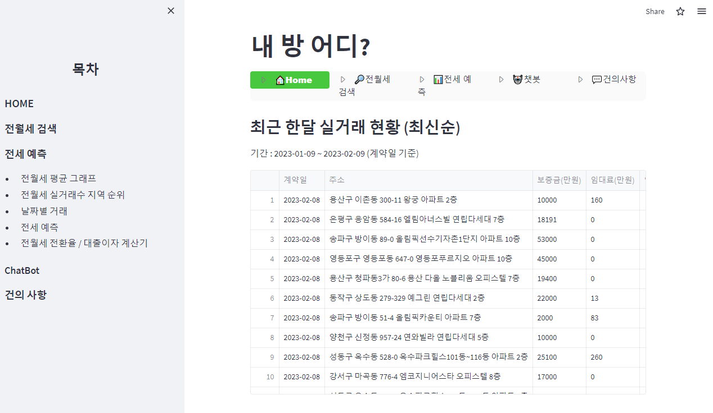

# 내 방 어디? (version2)
- [streamlit 배포 링크](https://tkfk418-project1-app-9epcxk.streamlit.app/)

***

### Update 내용
- 기존 CSV 파일 사용 ==> 최신 업데이트된 데이터를 가져와 DB에 저장 후 사용
  - 기존 CSV 파일에서 Open API 최신 업데이트된 데이터를 가져와 DB로 저장하는 방식
- 전/월세검색 페이지에 slider와 input 동기화 작업
- 전세예측 페이지에서 전세예측, 전월세 월평균 그래프, 전월세 실거래수 지역 순위, 날짜별 거래, <br> 
전월세 전환율 / 대출이자 계산기 페이지 추가 및 구현
- 챗봇 기능 추가
- 건의사항 페이지에서 수정/삭제, 검색 기능 추가 및 구현

# 데모 시연
- 먼저 프로젝트 파일을 다운로드 받습니다. 

```bash
git clone https://github.com/tkfk418/project1.git
```

- 프로젝트 경로에서 가상환경 설치 후 접속합니다. (Windows 10 기준)
```bash
virtualenv venv
source venv/Scripts/activate
```

- 라이브러리를 설치합니다. 
```bash
pip install -r requirements.txt
```

- streamlit 명령어를 실행합니다. 
```bash
streamlit run app.py
```

- 그 외의 추가적인 설명은 다음 PDF 파일 및 동영상을 참고하세요. 
  + PDF : 
  + 동영상 : https://www.youtube.com/watch?v=RbN39pUA1Ww

## 개요
### 1. 과제
- **서울시공공데이터**에서 **부동산실거래데이터**를 활용해 월세/전세 시세예측

### 2. 상세 설명
- 전세와 월세를 비교할 수 있는 서비스의 필요성 대두
- 현재 금리 인상 및 보증금 미반환 사고등으로 월세 비중 상승
- 월세 가격인상을 예상에 따른 소비자의 합리적인 소비 방향 예측하기

### 3. 팀 구성
- 사용언어 : Python : 3.9v
- 작업툴 : VS code
- 인원 : 3명
- 주요 업무 : 시나리오 기획, 데이터 전처리, ML/DL 구현 코드 작성, 시각화 코드 작성, PPT
- 기간 : 2023-01-30 - 2023-02-10
***

### 라이브러리 버전
- streamlit : 1.17.0v
- streamlit_option_menu : 0.3.2v
- pandas : 1.5.3v
- numpy : 1.24.1v
- matplotlib : 3.6.3v
- plotly : 5.13.0v
- seaborn : 0.12.2v
- geopandas : 0.12.2v
- scikit-learn : 1.2.1v
- tensorflow : 2.9.0v
- prophet : 1.1.2v
- openai : 0.26.5v
- streamlit_chat : 0.0.2.1v
- requsets : 2.28.2v <br>
<details>
<summary> 라이브러리 설명 </summary>

```
streamlit : 웹사이트 구현
streamlit_option_menu : 메뉴의 옵션 목록에서 단일 항목을 선택할 수 있게 해주는 streamlit 구성요소
pandas : 데이터 작업
numpy : 다차원 배열 작업
matplotlib : 데이터 시각화 (도식화)
plotly : 데이터 시각화
seaborn : matplotlib를 기반 시각화
geopandas : 지리정보 데이터 작업
scikit-learn : 머신러닝
tensorflow : 딥러닝 프로그램 구현
prophet : 시계열 예측 패키지
openai : GPT3
streamlit_chat : streamlit 구성요소 (AI챗봇)
requsets : HTTP 요청
```
</details>


## 소스코드 설명
***

## 기간
### 개발팀
- **2023-01-30**
- 전체적인 프로젝트 구상 및 회의
- Open api 수집
- 정보 수집
- 사람들의 문제 니즈 파악
***

- **2023-01-31**
- 오늘 한 것 
  - streamlit 배포 연습
  - 전체적은 Story 구상
  - 기본적은 UI 구현
- 오늘 못한 것
  - 추천기능 ==> 거래매물이 많은 지역 or 면정당 가격이 싼 곳
  - 전/월세 검색 페이지 구현
  - 건의사항 페이지 구현
- 내일 할 것
  - 전/월세 검색기능
  - 전/월세 비교
  - 구현기능 동기화
***
- **2023-02-01**
- 오늘 한 것
  - 홈페이지 (index페이지)
    - 기본적인 Layer 구상
    - 거래횟수가 많은 지역 순으로 데이터 정렬
  - 전/월세 페이지
    - Sidebar에서 조건에 맞는 검색 기능
    - 보증금, 월세, 면적의 최소, 최댓값을 지정해주는 슬라이더
    - 버튼 누를시 선택된 값에 해당하는 검색 결과
    - 면적 제곱미터를 평수로 변환 (Lambda 함수)
    - 필요한 컬럼을 조인하여 데이터 가공
    - 특정 칼럼에서 특정문자 삭제
  - 건의사항 페이지
    - 게시판 UI 및 기능 구현
    - sqlite 데이터베이스 연동
  - 동기화
- 오늘 못한 것
  - 홈페이지
    - 정렬한 데이터 추출
  - 전/월세 페이지
    - 전세와 월세를 동시에 보여주는 기능
    - 보증금 월세 범위가 예상보다 큼
  - 건의사항 페이지
    - 게시글 수정 & 삭제 기능
- 내일 할 것
  - 데이터 추가 핸들링
  - index페이지 디자인 마무리
  - 전세예측 페이지 구현
  - 게시글 수정 & 삭제 기능
  - 건의사항 내용 칸 늘리기
***
- **2023-02-02**
- 오늘 한 것
  - index 페이지 UI 디자인 변경
  - index 페이지 DataFrame구성 변경
  - 월/전세 전체 검색기능
  - 월세, 보증금, 면적 검색할 때 최소, 최댓값 입력 기능
  - 건의사항 목록 간격 수정
  - 건의사항 처리상태 변경 기능
  - 건의사항 제목, 사용자명 검색 기능
- 오늘 못한 것
  - 지역에 맞춘 keyword 알고리즘
  - 건의사항 게시글 조회, 수정, 삭제 기능
- 내일 할 것
  - index 페이지 keyword 알고리즘 구현
  - 건의사항 검색 UI 수정
  - 건의사항 내용 검색 기능 (디버깅)
  - 건의사항 검색 시 목록 수정
  - 건의사항 목록 간격
***
- **2023-02-03**
- 오늘 한 것
  - 검색 페이지 슬라이더 기능 조정
    - 슬라이더와 텍스트박스값 연동
  - 건의사항
    - 게시글 조회 기능
    - UI 변경
    - 관리자 메뉴 기능 추가
- 오늘 못한 것
  - csv데이터값 결함 수정
    - 월/전세 구분 오류 확인
  - 건의사항 목록 간격 지정
- 내일 할 것
  - csv데이터값 결함 수정
  - 건의사항 관리자 메뉴 숨기기
***
- **2023-02-06**
- 오늘 한 것
  - BigQuery를 통한 data cloud 구현 시도 (실패)
- 오늘 못한 것
  - 실시간 데이터 수집(api로 받기)
- 내일 할 것
  - 실시간 데이터 수집
  - 홈페이지 기능 재배치
***
- **2023-02-07**
- 오늘 한 것
  - 홈페이지 재배치
  - 검색 slider에 scale 추가
  - API data를 DB에 연결
- 오늘 못한 것
  - 실시간 데이터 수집
    - batch process 구현
- 내일 할 것
  - batch process 구현
***
- **2023-02-08**
- 오늘 한 것
  - 배치파일을 이용한 실시간 데이터 수집
  - 실시간 데이터받는 중 서치.py에 버그 수정
    - 받아오는 데이터들이 StringType이여서 int형으로 변환
  - 각 기능 설명 추가
  - 건의사항 UI 기능추가(진행중) 및 변경
- 오늘 못한 것
  - 전/월세 검색 페이지 버그 수정
- 내일 할 것
  - 전/월세 검색 페이지에 조회버튼 버그 수정
  - 배치파일을 이용해 update되는지 확인
***
- **2023-02-09**
- 오늘 한 것
  - 전/월세 조회버튼 버그 수정
  - Git push 배치 파일, API Data Update 배치 파일 생성
  - 건의사항 페이지 사용자 수정/ 삭제 기능 구현
  - 건의사항 페이지 관리자 기능 수정/삭제 탭으로 이동
  - 건의사항 페이지 목록 시간순 내림차순 정렬
  - suggestion.db(건의사항DB) data폴더로 경로 변경
***
- **2023-02-10**
- 오늘 한 것
  - 배치파일을 이용해 자동 업데이트
  - 데이터팀과 시스템 및 코드 통합
***

### 데이터팀
- **2023-01-31**
- 오늘 한 것
  - DATA 전처리 진행(ing)
  - 결측치 제거, 불필요한 데이터 제거
  - 시나리오 작성
- 오늘 못한 것
  - DATA 전처리
  - 월 평균 에측치 분석
  - 시나리오 재작성
  - 시각화, 예측모델
- 내일 할 것
  - *위 내용과 동일*
***
- **2023-02-01**
- 오늘 한 것
  - DATA 전처리 정리
  - 최적 시각화 그래프 서칭
  - 프로젝트 시나리오 재작성
  - streamlit 사용하여 행정구, 행정동 선택 가능한 multiselect 구현
  - 행정구, 행정동 별 데이터 시각화 코드 작성
- 오늘 못한 것
  - 데이터 전처리 (일평균)
  - 그래프 최적화
- 내일 할 것
  - 행정구, 행정동 별 일일 평균 시각화 코드 작성
  - 막대 및 지도 시각화
  - 시나리오 보충
***
- **2023-02-02**
- 오늘 한 것
  - 데이터 전처리 정리
  - 최적 시각화 그래프 서칭
  - 지도 그래프 시각화 코드 작성 (미완성)
  - 프로젝트 시나리오 재작성
  - streamlit 사용하여 행정구, 행정동 선택 가능한 multiselect 구현
  - 행정구, 행정동 별 데이터 시각화 코드 작성
- 오늘 못한 것
  - 데이터 전처리 (일일 평균)
  - 지도 그래프 시각화 코드 작성 (미완성)
  - 그래프 최적화
- 내일 할 것
  - 행정구, 동 별 일일 평균 시각화 코드 작성
  - 막대 및 지도 시각화
  - 시나리오 보충 (도식화)
***
- **2023-02-03**
- 오늘 한 것
  - json  파일 변경
  - csv 파일과 json 파일 병합
  - 지도 시각화 구현
  - 실거래가 머신러닝 코드 분석
  - 월세 실거래수 지역 순위 막대그래프 구현
  - 전세 실거래 수 지역 순위 막대그래프 구현
  - 전세 및 월세(보증금)  월 평균 라인그래프 구현
  - 실거래가 데이터 전처리 진행
- 오늘 못한 것
  - 실거래가 머신러닝 코드 구현
  - 전세 및 월세 실거래가 데이터 전처리
  - 전세 및 월세 실거래가 계산 레이아웃 구현
- 내일 할 것
  - 실거래가 머신러닝 코드 구현
  - 전세 및 월세 실거래가 데이터 전처리
  - 전세 및 월세 실거래가 계산 레이아웃 구현
  - 지도 시각화 수정
  ***
- **2023-02-06**
- 오늘 한 것
  - json  파일 geojson 으로 변경
  - csv 파일과 json 파일 병합
  - 지도 시각화 구현( 완료)
  - 실거래가 머신러닝 코드 분석( 진행중)
  - 실거래가 데이터 전처리 진행( 완료)
- 오늘 못한 것
  - 실거래가 머신러닝 코드 구현( 진행중)
  - 전세 및 월세 실거래가 계산 레이아웃 구현( 진행중)
- 내일 할 것
  - 실거래가 머신러닝 코드 구현
  - 전세 및 월세 실거래가 계산 레이아웃 구현
***
- **2023-02-07**
- 오늘 한 것
  - 실거래가 머신러닝 코드 구현1(완료)
  - 실거래가 머신러닝 코드 분석(완료)
  - 전세 및 월세 실거래가 계산 레이아웃 구현(진행중)
- 오늘 못한 것
  - 실거래가 머신러닝 코드 구현2(진행중)
  - 전세 및 월세 실거래가 계산 레이아웃 구현(진행중)
- 내일 할 것
  - 실거래가 머신러닝 코드 구현2
  - 전세 및 월세 실거래가 계산 코드 작성
***
- **2023-02-08**
- 오늘 한 것
  - LSTM 예측 모델 보완
  - prophet 예측 모델 완성
  - 그래프 레이아웃 시각화 수정( 구 선택 추가 )
  - ChatBot 데이터 연동
  - 전월세 전환 계산 1 구현 ( 전세 --> 월세 )
- 오늘 못 한 것
  - 머신러닝 시각화 레이아웃 수정
  - 전월세 전환 계산 2,3 구현( 월세--> 전세, 전환율 계산)
- 내일 할 것
  - ChatBot 데이터 수정
  - 머신러닝 시각화 레이아웃 수정
  - 전월세 전환 계산 2,3 구현( 월세--> 전세, 전환율 계산)
  ***
  ***